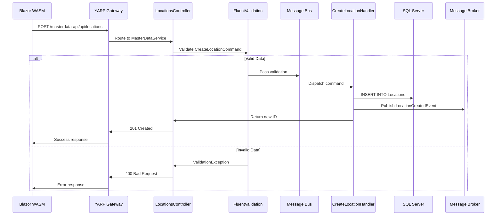

# Aspire With Friends - Technical Documentation

## 🏗 Architecture Overview

This project implements a modern microservices architecture using .NET 9, CQRS, event-driven communication, and API Gateway patterns.

```
┌─────────────────┐    ┌─────────────────┐    ┌─────────────────┐
│ Blazor WebAssembly │───▶│   YARP Gateway   │───▶│ MasterDataService │
│   (Port 5071)    │    │   (Port 5211)   │    │   (Port 5316)   │
└─────────────────┘    └─────────────────┘    └─────────────────┘
         │                       │                       │
         │                       │                       ▼
         │                       │              ┌─────────────────┐
         │                       │              │   SQL Server    │
         │                       │              │   (Port 1433)   │
         │                       │              └─────────────────┘
         │                       │                       │
         │                       ▼                       │
         │              ┌─────────────────┐              │
         │              │    RabbitMQ     │◀─────────────┘
         │              │   (Port 5672)   │
         │              └─────────────────┘
         │                       │
         ▼                       ▼
┌─────────────────┐    ┌─────────────────┐
│ NotificationHubService │    │   SignalR Hub   │
│   (Port 5317)   │    │   (Real-time)   │
└─────────────────┘    └─────────────────┘
```

---

## 🔄 CQRS (Command Query Responsibility Segregation)

### What is CQRS?
CQRS separates read and write operations into different models:
- **Commands**: Change state (Create, Update, Delete)
- **Queries**: Read state (Get, List, Search)
- **Handlers**: Process commands/queries
- **Events**: Notify other parts of the system about changes

### Command Flow Example



### Code Examples

**Command Definition:**
```csharp
public record CreateLocationCommand(string Name, string Type, int? ParentId);
```

**Validation Rules:**
```csharp
public class CreateLocationCommandValidator : AbstractValidator<CreateLocationCommand>
{
    public CreateLocationCommandValidator()
    {
        RuleFor(x => x.Name)
            .NotEmpty().WithMessage("Location name is required")
            .MaximumLength(100).WithMessage("Location name cannot exceed 100 characters");
        
        RuleFor(x => x.Type)
            .Must(BeValidLocationType).WithMessage("Location type must be one of: Building, Floor, Room, Area");
    }
}
```

**Handler Implementation:**
```csharp
public class CreateLocationHandler
{
    public async Task<int> Handle(CreateLocationCommand command)
    {
        // 1. Log the operation
        _logger.LogInformation("Creating location: {LocationName}", command.Name);
        
        // 2. Insert into database
        var id = await connection.ExecuteScalarAsync<int>(sql, command);
        
        // 3. Publish domain event
        await _bus.PublishAsync(new LocationCreatedEvent(id, command.Name, command.Type));
        
        // 4. Return new ID
        return id;
    }
}
```

**Controller Usage:**
```csharp
[HttpPost]
public async Task<IActionResult> Create([FromBody] CreateLocationCommand command)
{
    try
    {
        var id = await _bus.InvokeAsync<int>(command);
        return CreatedAtAction(nameof(GetById), new { id }, command);
    }
    catch (ValidationException ex)
    {
        var errors = ex.Errors.Select(e => e.ErrorMessage).ToList();
        return BadRequest(new { errors });
    }
}
```

---

## 🚪 YARP Gateway

### Purpose
YARP (Yet Another Reverse Proxy) acts as an API Gateway, providing:
- **Routing**: Direct requests to appropriate microservices
- **CORS**: Handle cross-origin requests from Blazor WebAssembly
- **Logging**: Track all incoming requests and responses
- **Health Checks**: Monitor service availability

### Configuration

**Routes:**
```json
{
  "masterdata-route": {
    "ClusterId": "masterdata-cluster",
    "Match": {
      "Path": "/masterdata-api/{**catch-all}"
    },
    "Transforms": [
      {
        "PathRemovePrefix": "/masterdata-api"
      }
    ]
  }
}
```

**Clusters:**
```json
{
  "masterdata-cluster": {
    "Destinations": {
      "masterdataapi-destination": {
        "Address": "http://localhost:5316/"
      }
    }
  }
}
```

### Request Flow
```
http://localhost:5211/masterdata-api/api/locations
                    ↓ (Remove /masterdata-api prefix)
http://localhost:5316/api/locations
```

---

## ✅ Validation (FluentValidation)

### Validation Rules

**Location Name:**
- Required (not empty)
- Maximum 100 characters
- Alphanumeric with spaces, hyphens, underscores only

**Location Type:**
- Required
- Must be one of: Building, Floor, Room, Area

**Parent ID:**
- Optional
- Must be greater than 0 when specified
- Cannot be the same as the location's own ID

### Validation Flow
```
API Request → FluentValidation → Valid? → Handler : ValidationException
```

### Error Response Example
```json
{
  "errors": [
    "Location name is required",
    "Location type must be one of: Building, Floor, Room, Area"
  ]
}
```

---

## 📡 Event-Driven Architecture

### Domain Events

**Event Types:**
- `LocationCreatedEvent` - Published when location is created
- `LocationUpdatedEvent` - Published when location is updated
- `LocationDeletedEvent` - Published when location is deleted

**Event Flow:**
```
Handler → Domain Event → RabbitMQ → NotificationHubService → SignalR → Blazor WASM
```

### Event Handler Example
```csharp
public class LocationEventHandlers
{
    public void Handle(LocationCreatedEvent @event)
    {
        _logger.LogInformation("Location created: {LocationId} - {LocationName}", 
            @event.Id, @event.Name);
        
        // Could trigger:
        // - Search index updates
        // - Cache invalidation
        // - Notifications to other services
        // - Workflow triggers
    }
}
```

---

## 🔧 Wolverine Message Bus

### Purpose
Wolverine acts as the mediator between controllers and handlers:
- **Command Dispatch**: Routes commands to appropriate handlers
- **Validation Integration**: Automatically validates commands before processing
- **Event Publishing**: Publishes domain events to message brokers
- **Error Handling**: Provides structured error handling

### Configuration
```csharp
builder.Services.AddWolverine(opts =>
{
    opts.UseRabbitMq(rabbitMqConnectionString)
        .AutoPurgeOnStartup()
        .AutoProvision();
    
    opts.UseFluentValidation();
    
    opts.Policies.UseDurableOutboxOnAllSendingEndpoints();
    opts.Policies.UseDurableInboxOnAllListeners();
});
```

---

## 🧪 Testing

### Postman Collection
**File:** `AspireApp.MasterDataService/Data/Postman/AspireApp_YARP_Collection.json`

**Test Categories:**
1. **Gateway Tests**
   - Gateway Status: `GET http://localhost:5211/`
   - Health Check: `GET http://localhost:5211/health`

2. **Master Data API Tests**
   - Get All Locations: `GET http://localhost:5211/masterdata-api/api/locations`
   - Create Location (Valid): `POST http://localhost:5211/masterdata-api/api/locations`
   - Create Location (Invalid): Tests validation
   - Update Location: `PUT http://localhost:5211/masterdata-api/api/locations/{id}`
   - Delete Location: `DELETE http://localhost:5211/masterdata-api/api/locations/{id}`

### Validation Test Cases

**Valid Request:**
```json
POST http://localhost:5211/masterdata-api/api/locations
{
  "name": "Main Building",
  "type": "Building",
  "parentId": null
}
```
**Response:** `201 Created`

**Invalid Request:**
```json
POST http://localhost:5211/masterdata-api/api/locations
{
  "name": "",
  "type": "InvalidType",
  "parentId": null
}
```
**Response:** `400 Bad Request` with validation errors

---

## 🔄 Complete Request Flow Example

### 1. Create Location Request
```
POST http://localhost:5211/masterdata-api/api/locations
Content-Type: application/json

{
  "name": "Engineering Building",
  "type": "Building",
  "parentId": null
}
```

### 2. Flow Through System
1. **YARP Gateway** (Port 5211) receives request
2. **Routes** to MasterDataService (Port 5316)
3. **Controller** receives `CreateLocationCommand`
4. **FluentValidation** validates the command
5. **Wolverine** dispatches to `CreateLocationHandler`
6. **Handler** logs operation start
7. **Database** inserts new location
8. **Handler** publishes `LocationCreatedEvent`
9. **RabbitMQ** receives the event
10. **NotificationHubService** processes event
11. **SignalR** sends real-time update to Blazor WASM
12. **Response** returns 201 Created with new ID

### 3. Response
```http
HTTP/1.1 201 Created
Location: /api/locations/1
Content-Type: application/json

{
  "name": "Engineering Building",
  "type": "Building",
  "parentId": null
}
```

### 4. Real-time Update
Blazor WebAssembly receives SignalR notification and updates the UI in real-time.

---

## 🚀 Benefits of This Architecture

### 1. **Separation of Concerns**
- Commands handle write operations
- Queries handle read operations
- Handlers encapsulate business logic
- Controllers focus on HTTP concerns

### 2. **Validation**
- Automatic validation before processing
- Clear error messages
- Prevents invalid data from reaching database

### 3. **Event-Driven**
- Loose coupling between services
- Real-time updates
- Extensible architecture

### 4. **Observability**
- Comprehensive logging
- Request/response tracking
- Error handling and monitoring

### 5. **Scalability**
- Microservices can scale independently
- Message-based communication
- API Gateway provides unified entry point

---

## 📚 Key Technologies

| Technology | Purpose | Version |
|------------|---------|---------|
| .NET 9 | Framework | 9.0 |
| Blazor WebAssembly | Frontend | 9.0 |
| YARP | API Gateway | 2.3.0 |
| Wolverine | Message Bus | 4.7.0 |
| FluentValidation | Validation | 12.0.0 |
| RabbitMQ | Message Broker | Latest |
| SignalR | Real-time Communication | 9.0 |
| SQL Server | Database | Latest |
| Dapper | Micro-ORM | 2.1.66 |

---

## 🔗 Useful Links

- [Wolverine Documentation](https://wolverine.netlify.app/)
- [YARP Documentation](https://microsoft.github.io/reverse-proxy/)
- [FluentValidation Documentation](https://docs.fluentvalidation.net/)
- [.NET Aspire Documentation](https://learn.microsoft.com/en-us/dotnet/aspire/)
- [Blazor WebAssembly Documentation](https://learn.microsoft.com/en-us/aspnet/core/blazor/)

---